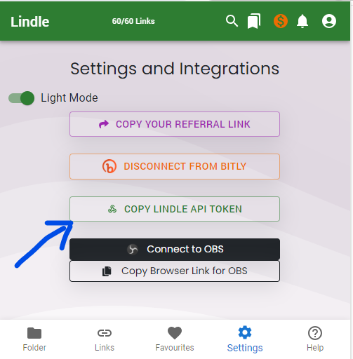

# Lindle PHP
Lindle is your ultimate solution for managing and organizing your web links with ease. This versatile Chrome extension empowers you to save, categorize, and access your online resources like never before.

<a href="https://www.buymeacoffee.com/m2kdevelopments" target="_blank">

</a>

<a href="https://play.google.com/store/apps/details?id=com.m2kdevelopments.lindle" target="_blank">
    
</a>
<a href="https://chrome.google.com/webstore/detail/igkkojjaikfmiibedalhgmfnjohlhmaj" target="_blank">
    
</a>


## API Documentation
The <a href="https://lindle.me/api-docs">API Documentation</a> for Lindle.


## Installation
```
composer install lindle
```
 
## Getting Started
Get your Lindle API key from <a href="https://chrome.google.com/webstore/detail/igkkojjaikfmiibedalhgmfnjohlhmaj">Chrome Extension</a>.
<br/>


```
$apiKey = "YOUR_API";
$lindle = new Lindle($apiKey);
```

## Get Links
```
$links = $lindle->getLinks();
print_r($links);

```


## Get Folders
```
$folders = $lindle->getFolders();
print_r($folders);
```


## Get Synced Bookmarks
```
$data = $lindle->getSyncedBookmarks();
print_r($data['links']);
print_r($data['folders']);
```
